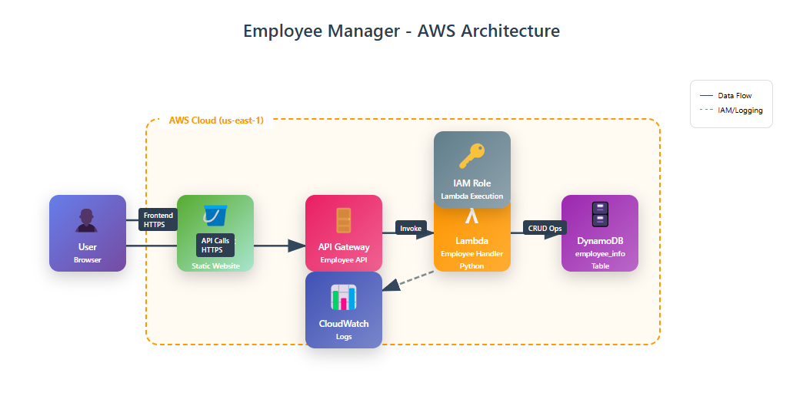

# Serverless REST API – Employee Manager

A fully serverless CRUD application built using AWS Lambda, API Gateway, DynamoDB, and S3. It allows users to manage employee records from a hosted frontend.

---

## 🧩 Architecture



- **API Gateway** – Exposes RESTful endpoints
- **Lambda Functions** – Handle business logic
- **DynamoDB** – Stores employee records
- **S3** – Hosts the frontend UI
- **IAM Roles** – Secure access control
- **CloudWatch** – Logs and monitoring

---

## 🌐 Live Demo

▶️ [Frontend Live Site](http://aws-mz.s3-website-us-east-1.amazonaws.com)

---

## 🚀 Features

- Create, Read, Update, and Delete employee records
- Clean responsive UI (HTML + JS)
- Full CORS support
- Deployed fully on AWS with no server management

---

## 🛠️ Setup

### 1. Deploy Lambda Function

- Use the code in `backend/lambda_function.py`
- Set runtime to **Python 3.12**
- Assign an IAM role with `AmazonDynamoDBFullAccess` and `AWSLambdaBasicExecutionRole`
- Create a DynamoDB table: `employee_info` with `employeeid` as the primary key

### 2. Setup API Gateway

- Create a REST API with methods: `GET`, `POST`, `PATCH`, `DELETE`, `OPTIONS`
- Integrate with your Lambda using **Lambda Proxy**
- Enable **CORS** for all methods

### 3. Upload Frontend to S3

- Upload `frontend/index.html`
- Enable static website hosting
- Make the bucket public or use CloudFront

---

## 📁 Project Structure

```

├── architecture-diagram.png
├── backend/
│   ├── lambda\_function.py
│   └── requirements.txt
├── frontend/
│   └── index.html
└── README.md

```

---

## 👨‍💻 Author

Graduation Project – AWS Solutions Architect  
Instructor: Ayman Aly Mahmoud | [LinkedIn](https://www.linkedin.com/in/aymanalymahmoud)  
